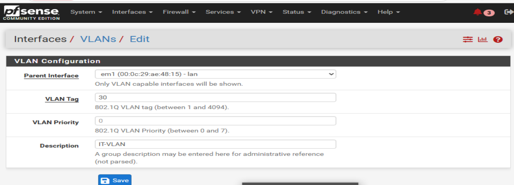
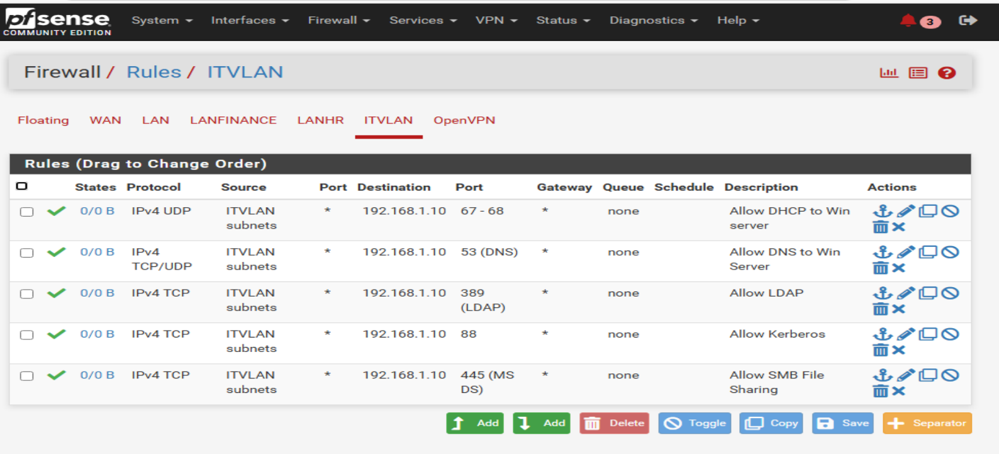
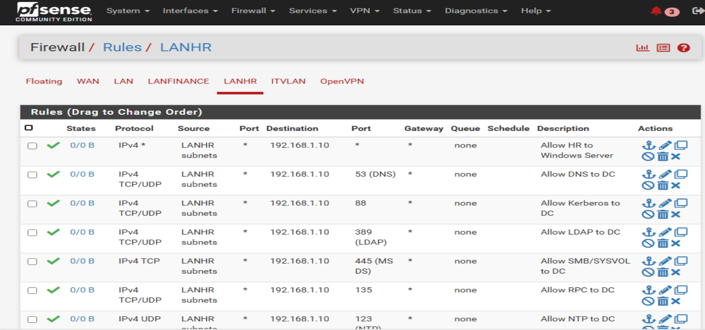

# pfSense-Firewall-WindowsServer-Win10-Lab

This lab demonstrates a full **network and Active Directory environment** with:

- pfSense firewall with VLANs, pfBlockerNG, OpenVPN, and DHCP Relay  
- Windows Server 2022 as Domain Controller with AD, DNS, DHCP, GPO, shared drives, and NPS (RADIUS)  
- Windows 10 domain-joined client with folder redirection, mapped drives, and VPN connectivity  

> NOTE! All IPs, domain names, and hostnames are placeholders for security.

## Table of Contents
1. [Lab Overview](#lab-overview)
2. [Network Diagram](#network-diagram)
3. [pfSense Configuration](#pfsense-configuration)
4. [Windows Server Setup](#windows-server-setup)
5. [Windows 10 Client](#windows-10-client)

## Lab Overview

| Component           | Hostname      | IP Address       | Role / Services                       |
|--------------------|--------------|----------------|--------------------------------------|
| Firewall           | pfSense      | 192.168.10.1   | LANs, VLANs, DHCP Relay, OpenVPN, pfBlockerNG |
| Domain Controller   | DC01         | 192.168.10.10  | AD DS, DNS, DHCP, GPO, Shared Drives, NPS |
| Windows 10 Client   | WIN10-CL01   | DHCP           | Domain-joined, mapped drives, VPN    |

## Network Diagram

# pfSense Configuration

## Overview
pfSense is deployed as the primary firewall and router in this lab environment. It handles VLAN segmentation, DHCP relay, VPN connectivity, and firewall rules to control traffic between subnets and the Internet.

**Lab Role:**
- LAN gateway for Windows Server and Windows 10 clients
- Inter-LAN/VLAN routing
- VPN server for remote access
- Internet access via NAT
> NOTE! All IPs, domain names, and hostnames are placeholders for security.

## Interfaces & VLANs

**Description:**  
The following VLAN and LANs are configured for network segmentation:

| Name       | Type | Subnet           | Purpose           |
|------------|------|-----------------|-----------------|
| LANHR      | LAN  | 192.168.10.0/24 | HR Department   |
| LANFINANCE | LAN  | 192.168.20.0/24 | Finance Dept    |
| ITVLAN     | VLAN | 192.168.30.0/24 | IT Department   |

- pfSense LAN IPs:  
  - LANHR: 192.168.10.1  
  - LANFINANCE: 192.168.20.1  
  - ITVLAN: 192.168.30.1
 

**Screenshots:**
- Interfaces Overview:  

- VLAN & LAN Configuration:  

## Firewall Rules

**Description:**  
Firewall rules control traffic between LANs/VLANs, the Internet, and VPN clients. Key rules include:

- **LANHR → DC:** Allow DNS & LDAP for domain authentication  
- **LANFINANCE → DC:** Allow necessary domain services  
- **ITVLAN → DC:** Full access for IT management tasks  
- **VPN → LANs:** Access restricted based on AD security groups

**Screenshots:**
- ITVLAN Rules:  

- LANHR Rules:  

- OpenVPN Rules:
- 

  ## DHCP & DHCP Relay

**Description:**  
pfSense handles DHCP for each LAN/VLAN or relays requests to the Windows Server DHCP where applicable.

**Screenshots:**
- DHCP Server for LANHR:  

- DHCP Relay Configuration:  

