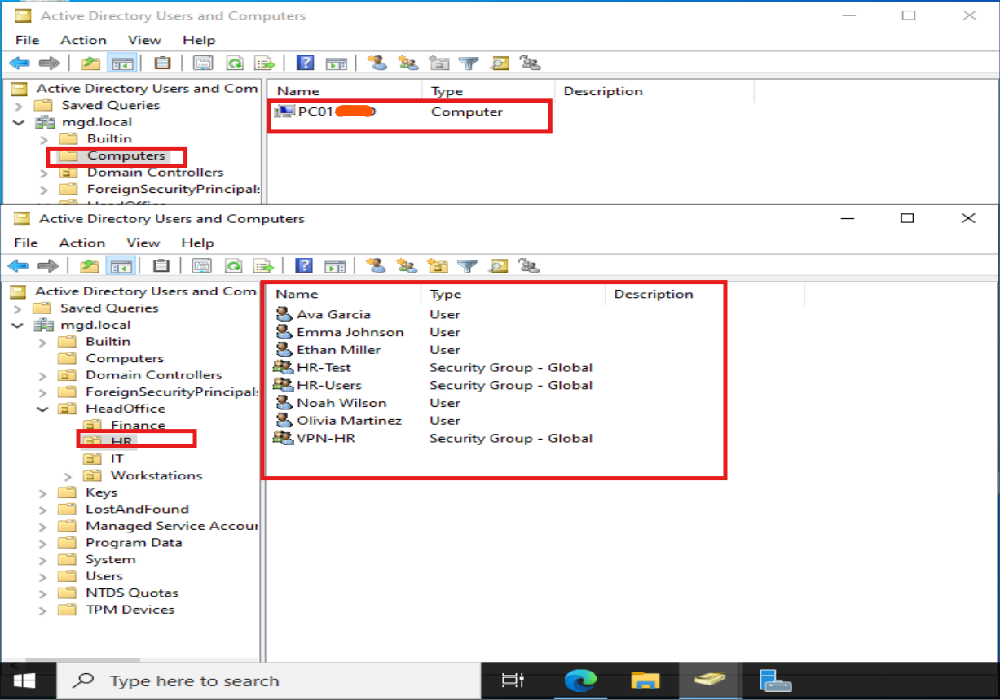

# pfSense-Firewall-WindowsServer-Win10-Lab

This lab demonstrates a full **network and Active Directory environment** with:

- pfSense firewall with VLANs, pfBlockerNG, OpenVPN, and DHCP Relay  
- Windows Server 2022 as Domain Controller with AD, DNS, DHCP, GPO, shared drives, and NPS (RADIUS)  
- Windows 10 domain-joined client with folder redirection, mapped drives, and VPN connectivity  

> NOTE! All IPs, domain names, and hostnames are placeholders for security.

## Table of Contents
1. [Lab Overview](#lab-overview)
2. [Network Diagram](#network-diagram)
3. [pfSense Configuration](#pfsense-configuration)
4. [Windows Server Setup](#windows-server-setup)
5. [Windows 10 Client](#windows-10-client)

## Lab Overview

| Component           | Hostname      | IP Address       | Role / Services                       |
|--------------------|--------------|----------------|--------------------------------------|
| Firewall           | pfSense      | 192.168.10.1   | LANs, VLANs, DHCP Relay, OpenVPN, pfBlockerNG |
| Domain Controller   | DC01         | 192.168.10.10  | AD DS, DNS, DHCP, GPO, Shared Drives, NPS |
| Windows 10 Client   | WIN10-CL01   | DHCP           | Domain-joined, mapped drives, VPN    |

## Network Diagram

# pfSense Configuration

## Overview
pfSense is deployed as the primary firewall and router in this lab environment. It handles VLAN segmentation, DHCP relay, VPN connectivity, and firewall rules to control traffic between subnets and the Internet.

**Lab Role:**
- LAN gateway for Windows Server and Windows 10 clients
- Inter-LAN/VLAN routing
- VPN server for remote access
- Internet access via NAT
> NOTE! All IPs, domain names, and hostnames are placeholders for security.

## Interfaces & VLANs

**Description:**  
The following VLAN and LANs are configured for network segmentation:

| Name       | Type | Subnet           | Purpose           |
|------------|------|-----------------|-----------------|
| LANHR      | LAN  | 192.168.10.0/24 | HR Department   |
| LANFINANCE | LAN  | 192.168.20.0/24 | Finance Dept    |
| ITVLAN     | VLAN | 192.168.30.0/24 | IT Department   |

- pfSense LAN IPs:  
  - LANHR: 192.168.10.1  
  - LANFINANCE: 192.168.20.1  
  - ITVLAN: 192.168.30.1
 

**Screenshots:**
- Interfaces Overview:  

- VLAN & LAN Configuration:  

## Firewall Rules

**Description:**  
Firewall rules control traffic between LANs/VLANs, the Internet, and VPN clients. Key rules include:

- **LANHR → DC:** Allow DNS & LDAP for domain authentication  
- **LANFINANCE → DC:** Allow necessary domain services  
- **ITVLAN → DC:** Full access for IT management tasks  
- **VPN → LANs:** Access restricted based on AD security groups

**Screenshots:**
- ITVLAN Rules:  

- LANHR Rules:  

- OpenVPN Rules:
- 

  ## DHCP & DHCP Relay

**Description:**  
pfSense handles DHCP for each LAN/VLAN or relays requests to the Windows Server DHCP where applicable.

**Screenshots:**
- DHCP Server for LANHR:  

- DHCP Relay Configuration:  

## OpenVPN Remote Access

**Description:**  
OpenVPN is installed and configured on pfSense to provide secure remote access to internal LANs/VLANs. Authentication uses **Active Directory via LDAP** and **certificate-based authentication**. Some clients may experience connectivity issues due to firewall, routing, or LDAP settings.

**Screenshots:**  
- OpenVPN Server Configuration:  
  

- Certificate Authority & User Certificates:  
  

- LDAP Authentication Server:  
  

- OpenVPN Client Export (Inline Config – Most Clients):  
  

- OpenVPN Firewall Rules:  
  

- Windows 10 installed VPN:  

## Windows Server Setup

**Description:**  
Windows Server 2022 is deployed as the **Domain Controller** for the lab environment. It handles **Active Directory, DNS, DHCP, Group Policy, Shared Drives, and NPS/RADIUS for VPN**. The server is integrated with pfSense as the LAN gateway and manages network services for all VLANs.

**Configuration Details:**

| Service / Feature          | Description |
|----------------------------|------------|
| Active Directory Domain Services (AD DS) | Created domain and organized users into 3 OUs: HR, Finance, IT |
| DNS | Forward and Reverse Lookup Zones configured for the lab domain |
| DHCP | Configured per OU/subnet, with pfSense DHCP relay enabled where needed |
| Shared Drives | Created departmental shares with `$` hidden option |
| Group Policy Objects (GPO) | Folder redirection, password policies, account lockout policies |
| NPS / RADIUS | Configured for OpenVPN LDAP authentication |
| Security Groups | Created for VPN access and folder permissions |

**Screenshots:**  
- Active Directory Users & Computers:  
  

- Organizational Units (HR, Finance, IT):  
  

- DHCP Configuration per OU/Subnet:  
  

- DNS Forward & Reverse Lookup Zones:  
  

- Shared Drives & Permissions:  
  

- Group Policy: Folder Redirection & Password Policies:  
  

- Security Groups for VPN and Folder Access:  

## Windows 10 Client Setup

**Description:**  
Windows 10 clients are domain-joined and configured to access network resources. Each client is part of the appropriate OU (HR, Finance, or IT) and inherits Group Policy settings from the server. Key features configured include:

- Domain join with AD authentication  
- Folder redirection and mapped network drives via Group Policy  
- VPN connectivity to pfSense OpenVPN server using AD credentials  
- Local PC renaming according to lab naming convention

### Domain Join Confirmation

### Domain User Login

### Folder Redirection

### Mapped Network Drives

### OpenVPN Connection

